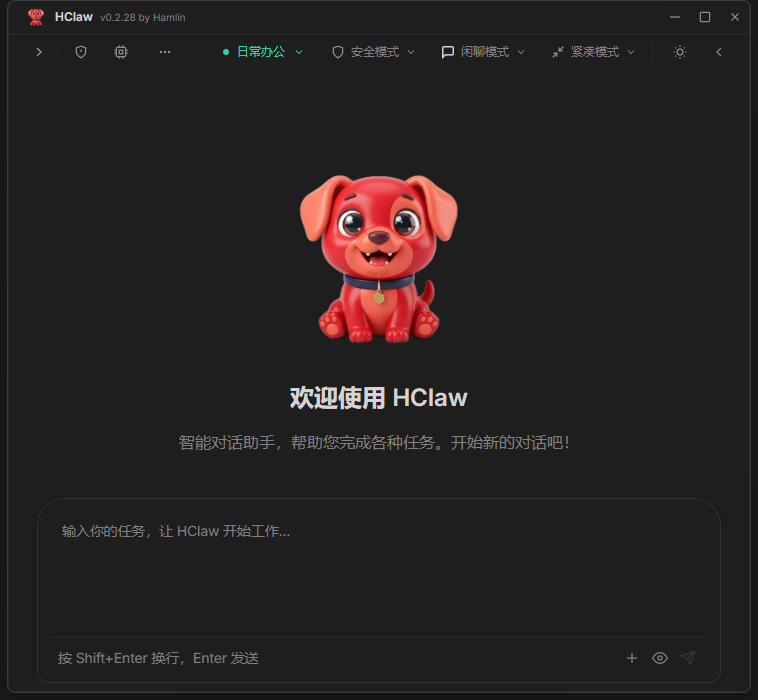
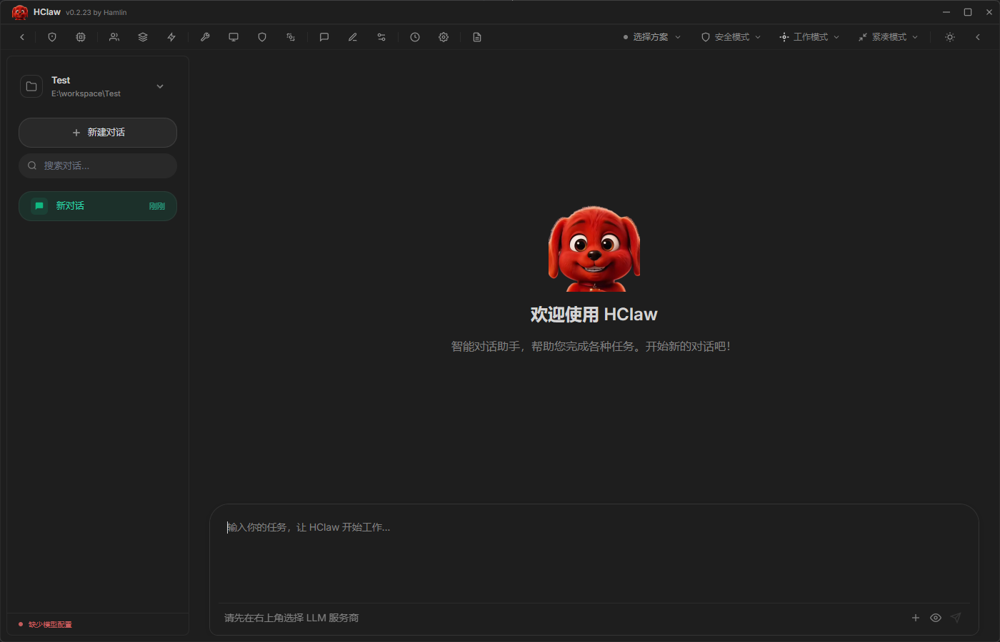
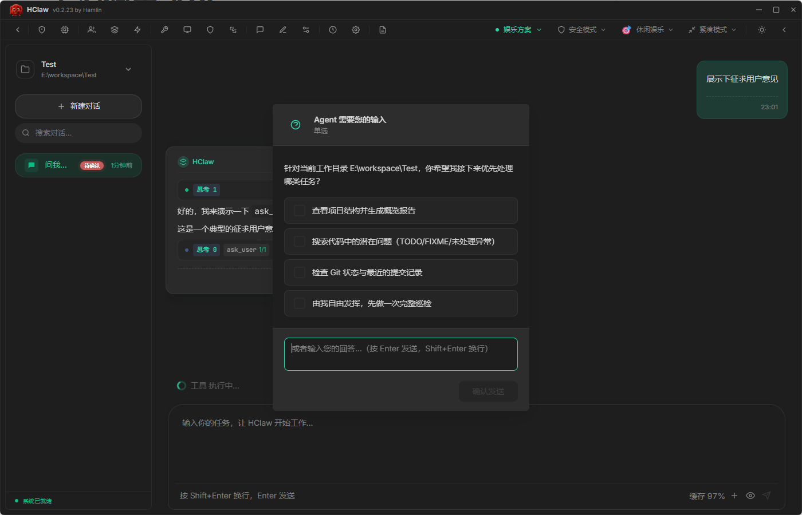
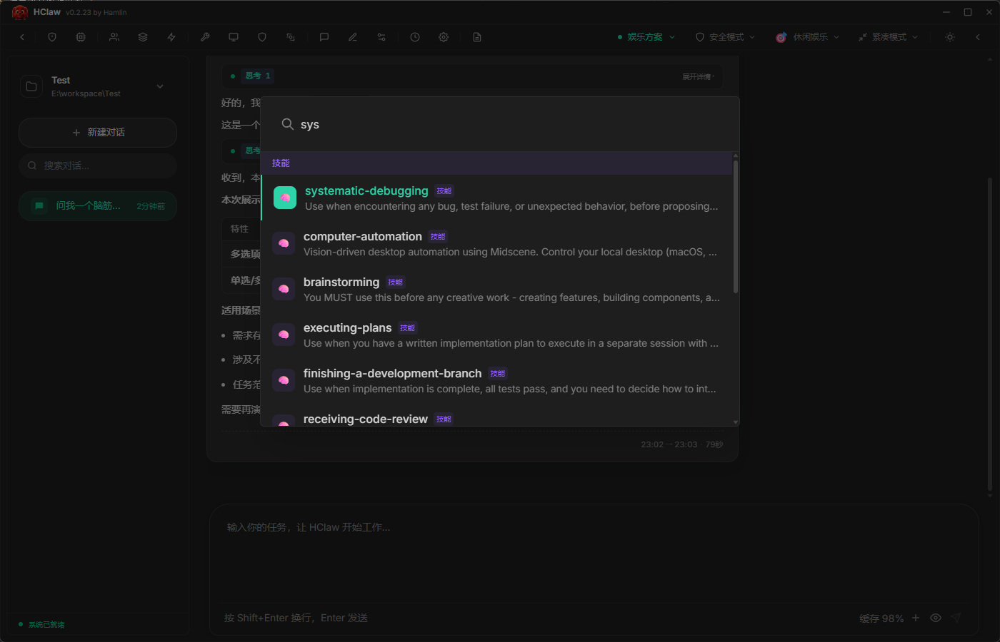
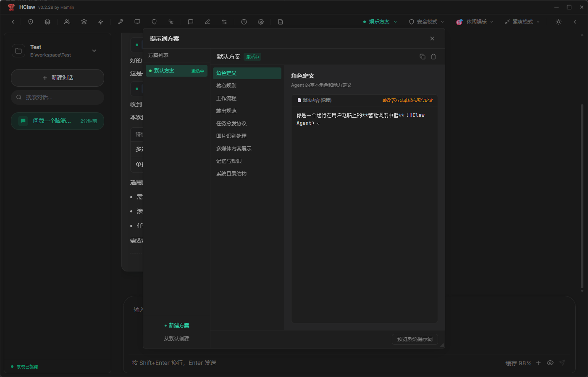
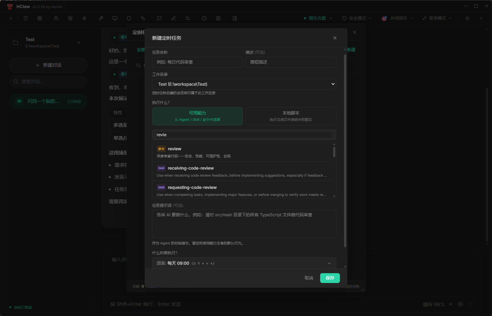
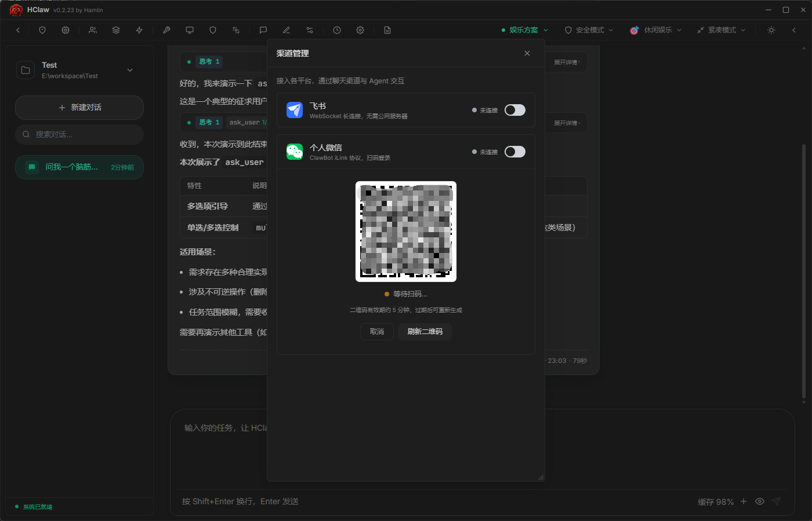
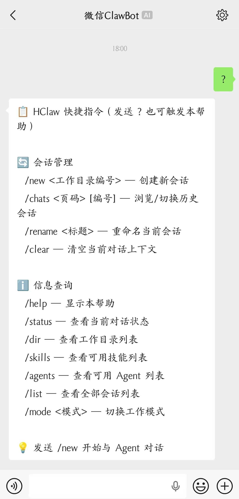

# HClaw

本地 Agent 客户端 

> HClaw 是一款面向未来的本地 AI Agent **桌面客户端**。极致的交互体验，让能力的调用如行云流水般自然——无论是快捷指令的即时响应，还是复杂任务的无缝调度，一切尽在指尖。

> 抖音介绍视频搜索：hamlin_zy
> 
> [B站介绍视频](https://www.bilibili.com/video/BV1nSE46bEGY/?share_source=copy_web&vd_source=7926fed9fc131c8b68d4dceee610fdbb)

## 🚀 亮点速览

- **极简安装** — 像安装微信一样简单
- **即时通讯同步** — 桌面端与 IM (个人微信 + 飞书接入) 渠道消息实时同步
- **缓存命中率95%+** — 切换任意模型，任意服务商，优化缓存命中率，节省Token成本
- **多模型动态切换** — 支持 Anthropic / OpenAI / Google API / Ollama，对话中随时切换，交叉使用，请求不中断
- **全图形化操作配置** — Agent、Skills、命令、工具、MCP、Hooks、渠道、提示词、插件、定时任务… 全部可视化界面管理，无需编辑配置文件
- **数据安全** — 所有数据本地存储，除了LLM请求，自动安装git插件仓库，没有任何外部请求发出

> HClaw 本质上是一个本地Agent壳子，所有配置项开放，您可以基于HClaw改造为您期望的Agent，HClaw开放系统提示词编辑，即时生效。
> 
> 对于新手，它像安装微信一样简单，没有学习成本
> 
> 对于各路大神，它完全的开放系统级配置，您可以自由编排自己的Agent，让HClaw以您设计的方式工作、回复。

### 系统要求

| 平台 | 支持版本 |
|------|---------|
| Windows | 10 / 11 (x64) |
| macOS | Intel + Apple Silicon |
| Linux | x64 (deb / AppImage) |

---

## 快速开始

### 1. 安装 HClaw

从 [Releases](https://github.com/hamlin-zy/hclaw/releases) 或 [百度网盘](https://pan.baidu.com/s/1EIlDiU-EiEEiF-oXrHhFdQ?pwd=nmhb) 下载适用于你系统的安装包。

> 💡 **无需配置任何环境变量**，也无需安装 Node.js、Python 等运行环境，下载后双击即可运行。
> 
> 💡 **升级**时，不会丢失本地配置(模型配置、插件、agents、skills等)，直接安装新安装包即可。

### 2. 启动后的配置(必要)

1. 安装完成后打开 HClaw
2. 在菜单中找到 **模型配置**，添加你的模型服务商 API Key（Deepseek、阿里百炼、豆包、GLM、MiniMax...）
3. 选择一个工作目录，新建一个会话，就可以开始使用了。

> 整个过程纯图形界面操作，不需要打开命令行。支持 Anthropic、OpenAI、Google ApiKey/Oauth 等主流模型服务商。

### 3. 连接 IM 渠道（可选）

打开 **菜单 → 渠道** 可连接个人微信、飞书，让 AI 助手直接出现在你的聊天列表里。

随时随地让HClaw协助你完成远程指令。

## 核心特性

| 特性                 | 说明                                                |
|--------------------|---------------------------------------------------|
| **多渠道接入**          | 支持个人微信、飞书等 IM 渠道，让 AI 融入日常聊天                          |
| **多模型支持**          | 支持 Anthropic、OpenAI、Google 等多种 API 格式，运行期间可动态切换模型 |
| **本地优先**           | 所有数据本地存储，保护隐私安全                                   |
| **会话管理**           | 多会话并行工作，侧边栏快速切换，高效管理多个任务上下文                       |
| **MCP服务生态**        | 图形化 MCP 服务配置，实现文件操作、浏览器自动化、图片、音频、视频生成等功能          |
| **Agent 管理**       | 图形化界面，便捷管理多个 Agent 配置和状态                          |
| **快捷指令**           | 支持 Commands 指令系统，图形化配置和管理快捷命令                     |
| **Skills 管理**      | 可视化技能管理内置/自定义技能                                   |
| **视觉理解**           | 支持图像识别和理解，可处理用户发送的图片内容                            |
| **音频理解**           | 内置语音识别（ASR），支持音频消息转文字处理                           |
| **系统提示词编辑**        | 灵活可编辑的系统提示词模板，随时调整 AI 行为模式                        |
| **定时任务**           | 支持 Cron 表达式调度，自动执行周期性任务，可指定Agent\skill\自定义提示词     |

## 快捷键

### 面板 & 窗口

| 快捷键 | 功能                  |
|-------|---------------------|
| `Ctrl + B` | 隐藏/显示 左侧栏           |
| `Ctrl + Shift + B` | 隐藏/显示 右侧栏           |
| `Ctrl + Shift + T` ⭐ | 切换主题：浅色、暗色、远山黛、 十样锦 |

### 输入 & 会话

| 快捷键 | 功能                               |
|-------|----------------------------------|
| `Ctrl + N` ⭐ | 新建会话                             |
| `Enter` | 发送消息                             |
| `Shift + Enter` | 换行                               |
| `Ctrl + K` ⭐ | 打开能力(Agents\Skills\Commands)选择弹窗 |
| `Ctrl + ↑ / ↓` | 切换输入历史                           |
| `Alt + ↑ / ↓` ⭐ | 切换会话（支持多会话任务并行）                  |

> 💡 **连招技巧**：`Ctrl+N` 新建会话 → `Ctrl+K` 选择能力（Agent、Skill） → 输入任务 → 回车。 这套动作可以反复操作，让 n 个会话同时并行工作，互不干扰。
> 
> 示例场景：
> - `Ctrl+N → Ctrl+K` 选 `brainstorming` → 输入"我想设计一个\*\*\*" → 回车
> - `Ctrl+N → Ctrl+K` 选 `systematic-debugging` → 输入"点击\*\*\*会报错：\*\*\*" → 回车
>
> 多个会话各自独立运行，互不阻塞。

### Agent & 权限

| 快捷键 | 功能          |
|-------|-------------|
| `Esc` | 终止 Agent 执行 |
| `Enter` | 允许当前工具调用    |

### 全局快捷键

| 快捷键                      | 功能             |
|--------------------------|----------------|
| `Ctrl + Shift + Space` ⭐ | 显示/隐藏 HClaw 窗口 |

> ⭐ 标记为效率神器，熟练使用可大幅提升操作效率。

## ❓ 常见问题

| 问题 | 回答 |
|------|------|
| **需要科学上网吗？** | 取决于你使用的模型服务商。如果使用国内模型（如 DeepSeek）则不需要。 |
| **需要购买什么？** | 需要自行在模型服务商（Anthropic、ChatGPT、DeepSeek、国内云厂商 等）购买 API Key，在客户端 UI 中配置即可使用。 |
| **我不会用命令行，能用吗？** | 完全不需要。HClaw 所有操作都是图形界面，下载双击安装，配置好 API Key 就能用。 |
| **数据安全吗？** | 所有对话数据存储在本地 SQLite 数据库中，不上传云端。连接 IM 渠道时，消息仅在本地处理。 |
| **如何更新？** | 关注 GitHub/Gitee Releases 页面获取新版通知，下载安装包覆盖安装即可（数据不会丢失）。 |
| **有使用限制吗？** | 客户端本身无任何限制，唯一的限制取决于你购买的模型服务商的 API 配额。 |

## 🚧 更多详细文档（持续完善中）

### 开始对话前的必要配置

| 功能                             | 说明                         |
|--------------------------------|----------------------------|
| [模型配置](./docs/model_config.md) | ✅ 配置 AI 模型服务商              |
| [模型方案](./docs/model_schema.md) | ✅ 配置模型方案，便于后续工作中，切换模型任务不中断 |
| [工作目录](./docs/work_dir.md)     | ✅ 配置HClaw当前工作目录            |

### 进阶配置

| 功能                               | 说明                |
|----------------------------------|-------------------|
| [Agent 管理](./docs/agent.md)      | ✅ 创建和管理 Agent     |
| [Skills 管理](./docs/skills.md)    | ✅ 技能安装和配置        |
| [MCP 管理](./docs/mcp.md)          | ✅ MCP 服务配置、状态、工具列表 |
| [插件管理](./docs/plugins.md)        | ✅ 插件安装和更新        |
| [会话管理](./docs/conversation.md)   | ✅ 多会话并行操作        |
| [提示词管理](./docs/prompt.md)        | ✅ 系统提示词编辑        |
| [工具管理](./docs/tools.md)          | ✅ 内置工具管理         |
| [快捷命令](./docs/commands.md)       | ✅ 命令创建和管理          |
| [定时任务](./docs/scheduler.md)      | ✅ Cron 任务调度        |

## UI预览

---
### 主页面

### 用户确认交互

### 能力搜索(快捷键CTRL+K)
可搜索已安装、内置、自定义 的`agent` `skill` 
可搜索已安装、内置、自定义 的`command`

### 自定义系统提示词
你可以自定义角色为任何名字， 
这是Agent默认系统提示词模板， 
你可以创建多个模板进行切换 
从而控制Agent行为，使其以你期望的行为方式，完成工作。

### 定时任务配置
已安装的能力，均可使用 
如果你已经连接了 个人微信、飞书 渠道，可以在下方提示词中写：“完成后，将结果发送到我的微信”

### 渠道配置

### 微信操作界面
提供快捷指令，和帮助信息，便于新手尽快上手

---

## 🔓 开源协议

HClaw 已正式开源，采用 **MIT 许可证**。

你可以在 [LICENSE](LICENSE) 文件中查看完整的许可条款。简而言之：
- ✅ 允许商业使用
- ✅ 允许修改和分发
- ✅ 允许私人使用
- ⚠️ 不提供任何担保

欢迎通过 [GitHub Issues](https://github.com/hamlin-zy/hclaw/issues) 反馈问题，或提交 PR 参与贡献。

---

## 🗺️ 路线图

| 阶段 | 状态 | 说明 |
|------|------|------|
| 产品可用 | ✅ 已完成 | 核心功能完善，可直接下载使用 |
| 安装教程视频 | 📹 筹备中 | 抖音/B站同步发布 |
| 开源发布 | ✅ 已完成 | MIT 许可证，源码公开 |
| 社区共建 | 🌱 持续 | 接收 PR、完善生态 |

## 💬 加入社区

| 渠道                                                         | 用途 | 状态                                                            |
|------------------------------------------------------------|------|---------------------------------------------------------------|
| [GitHub Issues](https://github.com/hamlin-zy/hclaw/issues) | 反馈 Bug、提交需求、讨论功能 | ✅ 已开放                                                         |
| 作者抖音                                                       | 安装教程、项目动态 | 抖音介绍视频搜索：hamlin_zy                 |
| 作者B站                                                       | 用户交流、答疑 | [hamlin-zy B站首页](https://space.bilibili.com/3707005250308201) |
| QQ 群                                                       | 用户交流、答疑 | 📹 即将开放                                                     |
| 微信群                                                        | 深度用户交流 | 📹 即将开放                                                       |

## ⭐ 支持项目

如果你喜欢 HClaw，欢迎在 GitHub 上点亮 Star ⭐，也欢迎提交 PR 参与贡献。

---

**HClaw** — 本地 AI Agent 桌面客户端 | [GitHub](https://github.com/hamlin-zy/hclaw) | [Releases](https://github.com/hamlin-zy/hclaw/releases)
