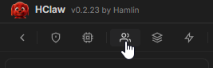
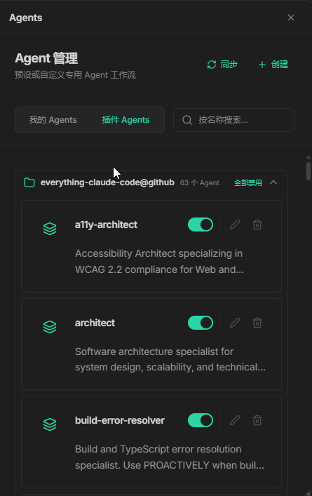
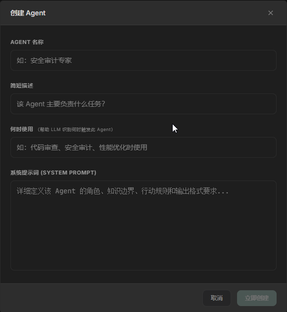
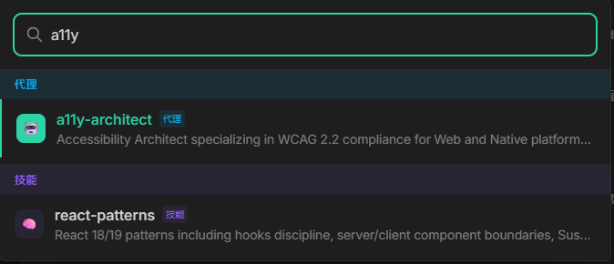

# Agent 管理

## 概述

Agent（代理）是 HClaw 中的智能角色。你可以将 Agent 理解为"具有特定专长的 AI 助手"——一个负责代码审查，一个负责创意写作，一个负责数据分析……在对话中随时切换或并行使用。

## 演示视频

> 🎥 演示视频制作中，敬请期待

## 开始配置

#### 进入 Agent 管理

1. 点击菜单中的 `Agents` 按钮

2. 进入 `Agent` 管理页面

#### 创建自定义 Agent

1. 点击「新建」按钮
2. 填写 **名称** 、 **描述** 、 **何时使用**（用于 HClaw 的自主匹配调用）
3. 点击「立即创建」

#### 您也可以主动使用`自建Agent` `插件Agent`

> 按 `Ctrl + K` 可快速搜索和切换 Agent

#### 编辑 `我的Agent`

点击 Agent 卡片上的编辑按钮，即可修改配置：

- **名称/描述/何时使用/提示词** — 随时调整
- **Agent启用/禁用** — 控制 Agent 对LLM的可见性

## 使用方式

在对话中使用 Agent 有2种方式：

1. **主 Agent** — 主 Agent 自主调用
2. **`Ctrl + K` 搜索** — 打开能力面板，选择您想使用的 Agent

## 注意

如果您不想手动编辑，随时可以通过对话，让HClaw帮您创建一个您想要的功能的Agent。

新的Agent会直接出现在Agents管理页面中。

您也可以让HClaw帮您优化提示词，比如某次使用该Agent完成工作后。

中间您提出了新的要求，代表Agent的工作表现尚有欠缺。

此时您可以让HClaw基于当前对话历史，优化这个Agent，以获得下次使用时的更好体验。

