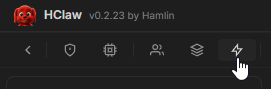
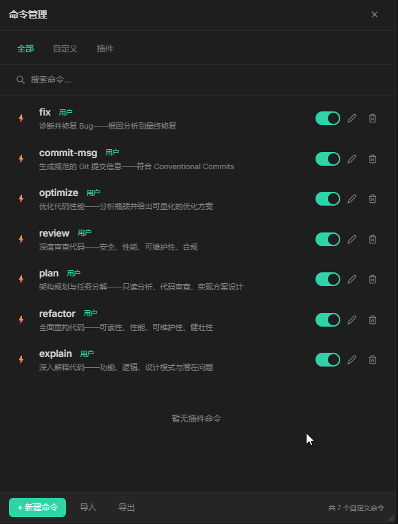
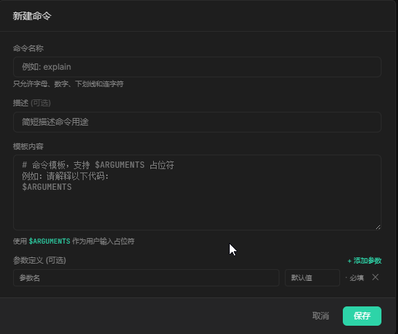
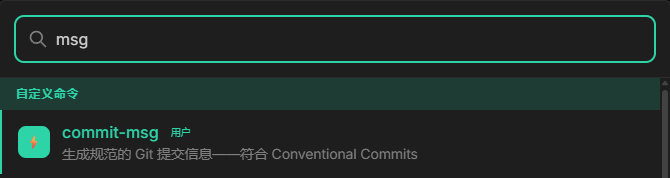

# 快捷命令

## 概述

快捷命令（Commands）是可以快速触发的预定义任务，通过 `/command` 语法在输入框中直接调用。一个命令可以触发特定提示词、调用技能、切换 Agent 或执行自定义脚本——相当于为常用操作设置"快捷方式"。

命令面板（`Ctrl + K`）是 HClaw 的核心效率工具，整合了 Agent、Skill、Command 的统一搜索入口。

## 演示视频

> 🎥 演示视频制作中，敬请期待

## 开始配置

#### 进入命令管理

1. 点击菜单中的 **命令**



2. 进入命令列表管理页面



#### 创建自定义命令

1. 点击「新建命令」按钮
2. 填写命令名称（不含 `/` 符号）
4. 编写模板
5. 参数定义不是必须的
6. 保存即可使用



#### 使用命令

在输入框中直接输入：

```
/fix
```

按 `Enter` 即可触发。

#### 命令面板（Ctrl + K）

按 `Ctrl + K` 打开能力面板，可搜索所有 Agent、Skill 和命令：



输入关键词即可快速定位，按 Enter 执行。

## 注意

- 命令名称不能重复
- 命令名称不含空格，推荐使用 `-` 连接（如 `daily-report`）
- 自定义命令可覆盖同名的内置命令行为
- 命令在当前会话中实时生效，无需重新创建会话

## 常见问题

**Q: 命令支持参数吗？**
- 支持。如 `/fix **错误` 中 `**错误` 就是参数
- 脚本类型命令支持更复杂的参数传递

**Q: 命令找不到怎么办？**
- 检查命令名称是否拼写正确
- 确认命令已启用
- 使用 `Ctrl + K` 搜索确认
