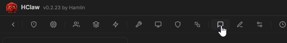
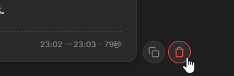
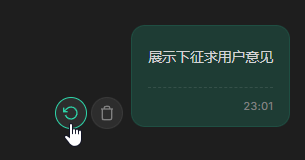
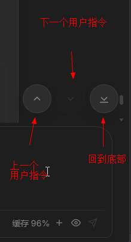

# 会话管理

## 概述

会话（Conversation）是 HClaw 中的独立对话单元，每个会话拥有完整的上下文记录和历史消息。HClaw 支持**多会话并行运行**——你可以同时开启多个会话，每个会话独立处理不同的任务，互不干扰。

这意味着：一个会话在生成代码的同时，另一个会话正在分析文档，第三个会话在联网搜索——全部同时进行。

## 演示视频

> 🎥 演示视频制作中，敬请期待

## 开始使用

#### 新建会话

通过以下方式之一新建会话：

| 方式 | 操作 |
|-----|------|
| **快捷键** | `Ctrl + N` |
| **侧边栏** | 点击会话列表顶部的「+」按钮 |

#### 切换会话

| 方式 | 操作 |
|-----|------|
| **快捷键** | `Alt + ↑ / ↓` 上下切换 |
| **侧边栏** | 直接点击目标会话 |

#### 多会话并行

多个会话可以同时运行：

1. 在会话 A 中发起任务（回车发送）
2. 按 `Alt + ↓` 切换到会话 B
3. 在会话 B 中发起另一个任务
4. 两个会话的 Agent 各自独立处理

> 💡 **连招技巧**：`Ctrl+N` 新建会话 → `Ctrl+K` 选择能力（Agent、Skill） → 输入任务 → 回车。重复这套操作，让 N 个会话同时并行工作。

#### 会话操作

- **置顶会话** — 右键会话 → 置顶会话，重要任务置顶
- **重命名** — 右键会话 → 重命名，便于查找
- **删除会话** — 右键 → 删除会话（不可恢复）
- **批量删除会话** 
  - 打开会话管理页面
  

  - 选中要删除的会话(手动选择、自动选择1天前、3天前...)，删除选中按钮会显示已选中的会话数量

    

- **删除消息** — 对话列表中，每个会话旁边会显示删除按钮
  - 常用场景：AI的某次响应不满意、异常等情况，可以点击删除消息
    
    
  - 用户指令-重试按钮
    
    

- **历史消息跳转** — 当您与HClaw进行了多轮会话之后，查看历史消息的快捷操作
  - 
- **快速复制&粘贴** — ⭐ 超好用
    - 消息列表中的所有文本，选中自动复制
  - 输入框中，点击鼠标右键，自动粘贴
> 数据仅存储在本地，不会上传到任何云端。

## 注意

- 会话切换不会中断正在运行的任务
- 删除会话不可恢复

## 常见问题

**Q: 最多可以开多少个会话？**
- 没有硬性限制，但建议根据电脑内存情况合理控制数量

**Q: 会话上下文会无限增长吗？**
- 不会。HClaw 会在上下文达到阈值时自动压缩
- 不建议在一次会话中，进行太多轮次的会话，**当您觉得AI变傻时**，建议让AI总结当前未解决的问题，新开会话处理。

**Q: 切换会话后之前的任务会中断吗？**
- 不会。Agent 会在后台继续执行，完成后你可以切换回去查看结果
- 遇到需要确认的情况，会话列表中能看到待确认标识，不应打扰当前进行中的会话。
