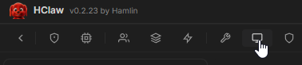
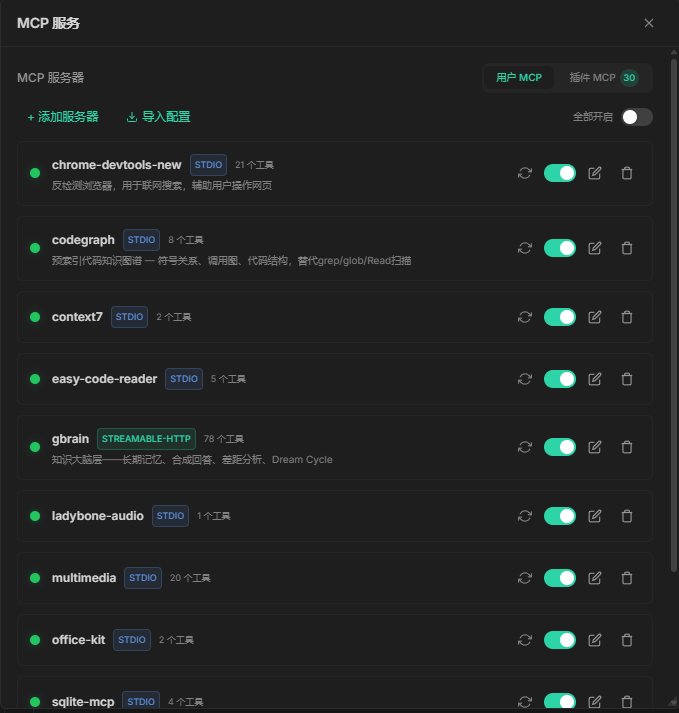
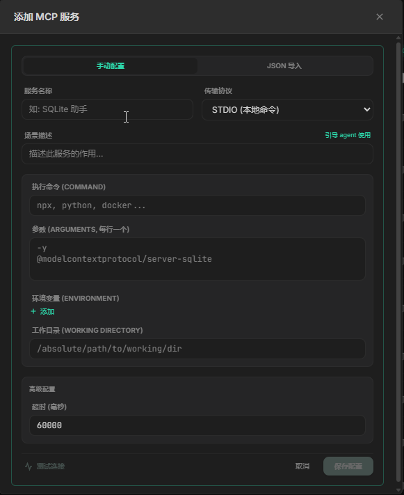
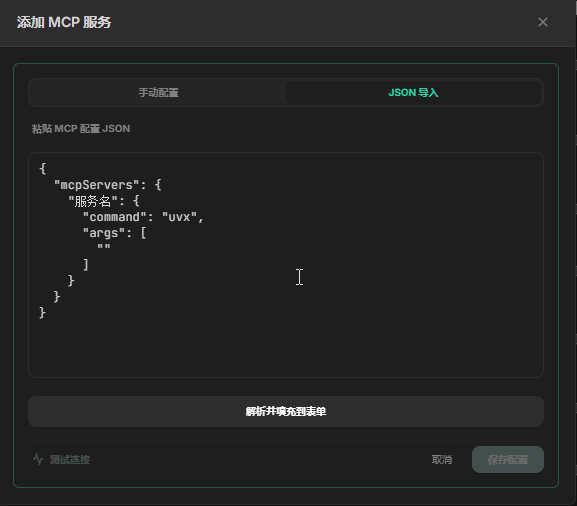

# MCP 管理

## 概述

MCP（Model Context Protocol）是 HClaw 的标准化扩展协议，让 Agent 能够与外部工具和服务无缝集成。

通过 MCP，Agent 可以：

- 🖼️ **生成图片** — 调用 AI 绘图服务
- 🎤 **语音识别** — 将音频转为文字
- 📄 **文档处理** — 解析 Word、Excel、PDF 等办公文件
- 🌐 **浏览器控制** — 自动化操作网页
- 🗄️ **数据库操作** — 查询和操作数据库
- 🖥️ **远程服务器** — SSH 执行命令

每个 MCP 服务就像一个"插件"，为 HClaw 增加新的能力维度。

## 演示视频

> 🎥 演示视频制作中，敬请期待

## 开始配置

#### 进入 MCP 管理

1. 点击菜单中的 **MCP**

2. 进入 MCP 服务管理页面

#### 支持的传输方式

MCP 服务支持两种传输方式：

| 方式                  | 说明 | 适用场景 |
|---------------------|------|---------|
| **HTTP**            | 通过 HTTP 协议连接远程服务 | 第三方 API 服务、自部署服务 |
| **SSE**             | Server-Sent Events，服务端单向推送事件流，客户端通过独立的 HTTP POST 发送请求，保持长连接实现实时通信 | 需要服务端实时推送通知/事件，但客户端请求频率较低的场景 |
| **WebSocket**       | 全双工通信协议，在单个 TCP 连接上实现双向实时数据传输，低延迟高频率 | 需要高频双向交互的场景，如实时协作、聊天、数据监控仪表盘 |
| **Streamable Http** | 基于 HTTP 的分块传输编码（chunked transfer），支持请求和响应的流式传输，无需持久连接 | 大文件流式处理、流式 AI 推理输出、需要逐步返回结果但不希望维持长连接的服务 |
| **STDIO**           | 通过本地进程的标准输入/输出通信 | 本地工具、Node.js/Python 脚本 |

> 💡 mcp服务 作者通常会告知传输类型

#### 添加 HTTP 类型 MCP 服务

操作步骤：
1. 点击「添加服务器」
2. 选择传输方式为 `HTTP`
3. 填写服务名称和 URL 地址
4. 如有需要，配置请求头（API Key 等）
5. 点击「测试连接」验证服务可用
6. 保存配置

快速添加:

> 💡 通常mcp服务作者，会提供一个json格式的配置说明，稍加改动后，使用json导入即可
> 
> 💡 您配置好的mcp服务，点击编辑按钮，从手动配置，切换到 JSON导入 界面，可以复制出来分享给他人

## 常用 MCP 服务推荐

您可以去一下几个网站搜索想要的mcp服务：
https://www.modelscope.cn/mcp
https://mcpmarket.com/

## 注意

- HTTP 服务需要确保网络可达
- STDIO 服务依赖本地运行环境（Node.js、Python 等）
- 部分 MCP 服务需要配置环境变量（在设置中统一管理），请详细阅读mcp服务的配置说明

## 常见问题

**Q: MCP 服务连接失败怎么办？**
- 检查 URL 或命令是否正确
- 确认MCP环境变量或参数中的 API Key 等认证信息有效
- STDIO 服务检查本地是否已安装相关依赖(可以让HClaw检查环境)
- 检查传输协议是否正确
- 让HClaw帮您检查启动失败的mcp服务配置是否有问题

**Q: MCP 服务会消耗 Token 吗？**
- MCP 服务本身不消耗 Token
- 但 MCP 返回的结果会被纳入上下文，间接影响 Token 消耗

**Q: 可以同时运行多个 MCP 服务吗？**
- 可以。所有已启用且状态为 🟢 的服务均可被 Agent 并行调用

**Q: 怎么确认我的mcp服务，llm能感知到？**
- 消息输入框下方有个`+`，点击后能看到`工具列表+MCP`，点击后可以看到当前llm能感知到的说有已启用工具和mcp服务工具列表