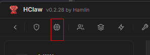
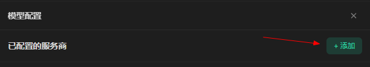
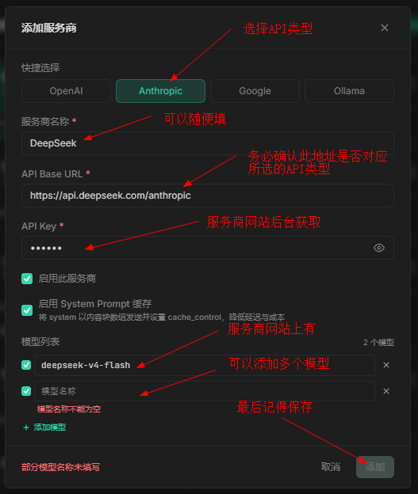
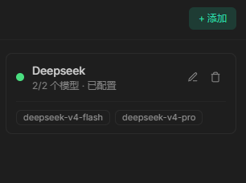

# 模型配置

## 概述

HClaw 支持市面上所有提供 Anthropic、OpenAI、Google、Ollama 接口的服务商。

## 演示视频

> 抖音介绍视频搜索：hamlin_zy
>
> [B站介绍视频](https://www.bilibili.com/video/BV1nSE46bEGY/?share_source=copy_web&vd_source=7926fed9fc131c8b68d4dceee610fdbb)

## 开始配置

#### 添加模型

点击菜单中的`模型`按钮



点击`添加`按钮



以DeepSeek为例，打开DeepSeek官方文档：https://api-docs.deepseek.com/zh-cn/

复制官方文档中的`base_url (Anthropic)` `api_key` `model`，填写到窗口中：


 
```aiignore
API类型 & API Base Url 务必匹配，请仔细阅读服务商文档，若配置错误，会出现LLM请求报错，长时间无响应等情况
```
## 配置完成


## 注意

在开始对话之前，还需要两步：
1. [配置模型方案](./model_schema.md)
2. [选择工作目录](work_dir.md)

## 常见问题

**Q: API 调用失败怎么办？**
- 检查使用的API类型
  - OpenAi 类型，base url通常以/v1结尾
  - Anthropic 类型，base url通常以/anthropic结尾
- 检查 API Key 是否正确
- 确认您的网络可以访问对应服务商的 API 地址
