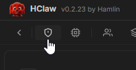
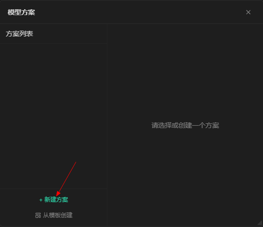
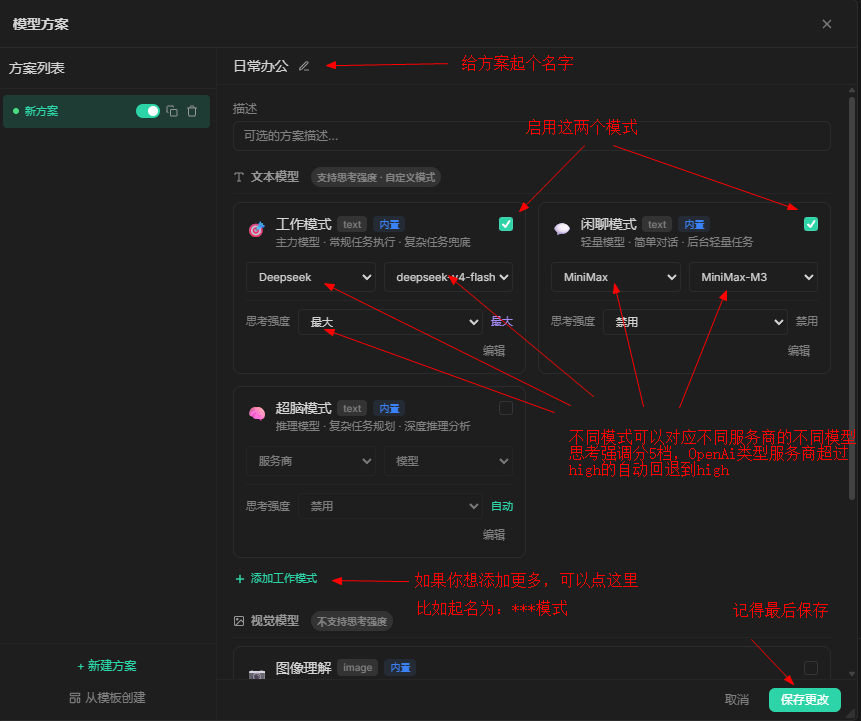
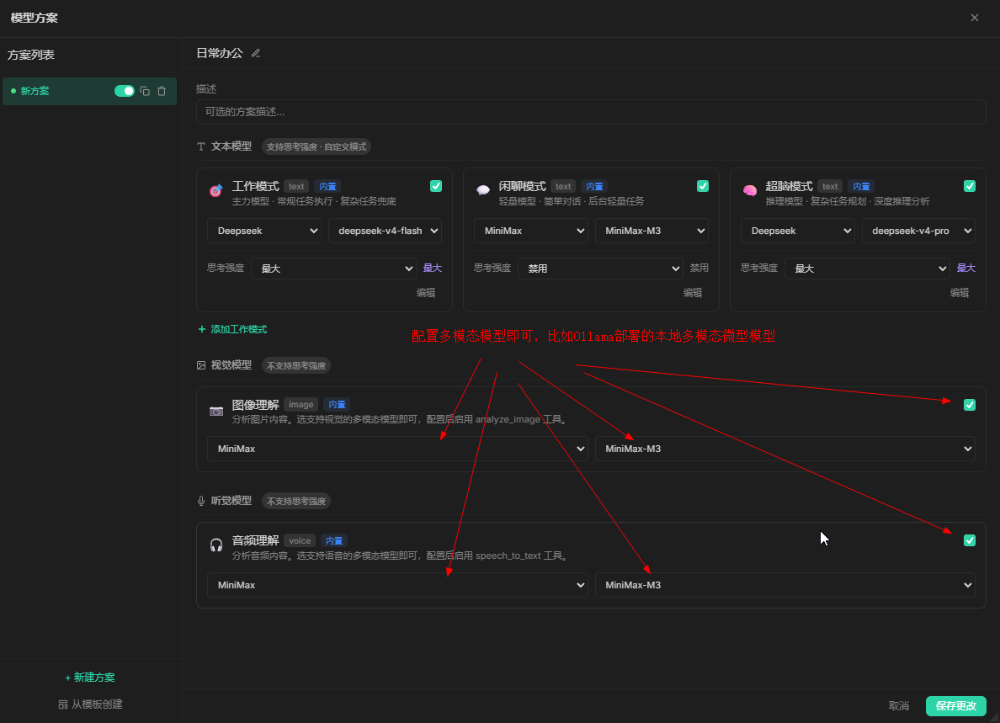

# HClaw `模型方案`配置

## 概述

`模型方案`用于定义 HClaw 调用模型时的参数模板。

## 演示视频

## 开始配置

#### 添加模型方案

1. 点击菜单中的`模型`按钮

2. 点击`新建方案`按钮

3. 配置`模型方案`

4. 配置`视觉模型` `听觉模型`

## 注意

在开始对话之前，还需要一步：
1. [选择工作目录](work_dir.md)