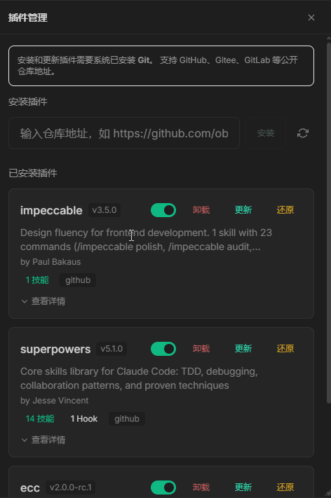

# 插件管理

## 概述

插件（Plugins）用于扩展 HClaw 的核心功能，支持命令增强、工具扩展。通过插件系统，HClaw 的功能边界可以持续扩展，原生支持Claude Code插件生态。

## 演示视频

> 🎥 演示视频制作中，敬请期待

## 开始配置

#### 进入插件管理

1. 点击菜单中的 `插件` 按钮


2. 进入插件浏览和管理页面




#### 安装

理论上支持Claude Code生态的所有插件

以obra/superpowers为例：

1. 在仓库地址处，粘贴git仓库地址：https://github.com/obra/superpowers
2. 点击安装按钮
3. 等待安装完成
4. 安装成功后，列表中会显示新插件
5. 移步Agents\Skills\命令\MCP 管理页面，点击刷新按钮，即可看到插件提供的各项能力。 
##### 注意
```aiignore
注意MCP管理页面中，插件MCP列表中，是否存在连接失败的mcp服务。 
如果您需要使用，可以编辑MCP，适配本地环境
如果您不需要，可以直接禁用
尽量不要存在无法使用的mcp服务处于启用状态，避免本机资源浪费

```

> 💡 需要您的电脑上安装 git 后，才能使用安装功能，如果您不会安装，可以问HClaw，根据提示逐步完成下载&安装后，在使用安装插件功能。


#### 更新&还原插件
```
当插件有新版本时：

    点击插件列表中「更新」按钮

当您修改了本地插件安装目录中的文件，导致出现一些奇怪的问题时：

    点击插件列表中「还原」按钮，一键恢复
```

## 注意

- 插件更新后如遇兼容问题，可联系作者或在 Issues 中反馈
- 禁用插件后，其提供的各项能力将不可用
- 卸载插件会清除插件安装目录

## 常见问题

**Q: 安装插件安全吗？**
- 仓库中的插件不保证100%安全，请自行甄别
- 本地安装的插件需要自行确认来源可靠

**Q: 可以安装多个同类插件吗？**
- 可以。多个命令插件、工具插件可共存使用
- 渠道插件一般同类只建议安装一个
