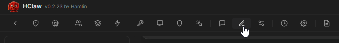

# 提示词管理

## 概述

系统提示词（System Prompt）定义了 AI 助手的角色定位、行为模式和回复风格。通过编辑提示词，你可以"调教" HClaw 以期望的方式思考和工作——让它更严谨、更创意、更专业或更亲切。

HClaw 提供可视化的提示词编辑界面，无需修改配置文件即可灵活调整。

## 演示视频

> 🎥 演示视频制作中，敬请期待

## 开始配置

#### 进入提示词管理

1. 点击菜单中的 **提示词**

2. 进入提示词编辑页面

#### 提示词节点结构

> 请自行探索，发现更多玩法~

#### 创建提示词方案

> 你可以克隆默认方案，改在为您喜欢的方案

#### 切换方案

1. 在提示词管理页面选择目标方案
2. 点击「激活方案」
3. 后续新建的会话将使用该方案

## 注意

- 修改提示词后仅**新会话**生效，当前会话不受影响
- 每个提示词节点，都提供了恢复默认按钮，请放心玩耍。
- 可通过创建不同方案来实现多种角色快速切换

## 常见问题

**Q: 提示词改坏了怎么办？**
- 每个节点都有「重置为默认」按钮

**Q: 提示词最长能写多少？**
- 没有硬性限制，但过长的提示词会占用上下文窗口，建议精简
