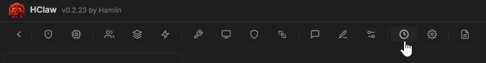
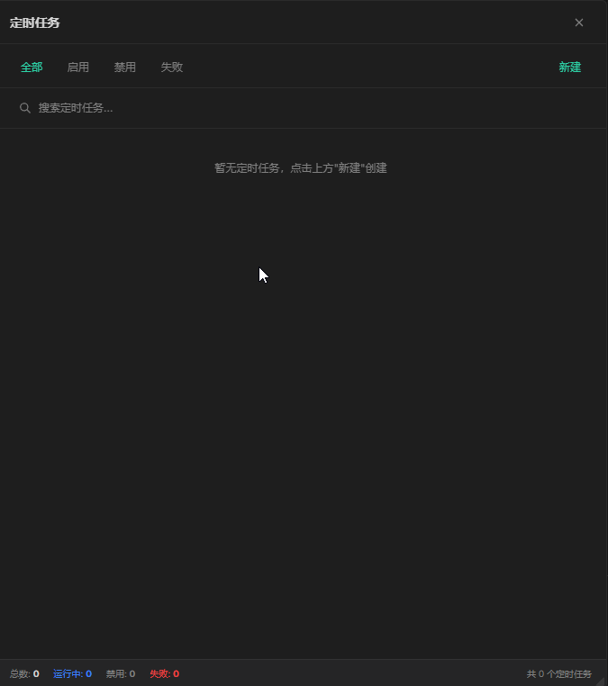
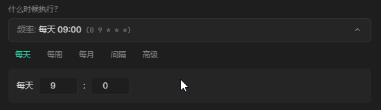

# 定时任务

## 概述

定时任务（Scheduled Tasks）基于 Cron 表达式自动调度，让 Agent 在指定时间自动执行任务。你可以设置每天定时发送日报、每 15 分钟检查服务器状态、工作日午夜执行数据备份等——一切自动进行，无需人工干预。

配合 IM 渠道（个人微信、飞书）使用效果更佳：任务完成后，Agent 可自动将结果发送到你的微信。

> 您也可以让HClaw帮您创建和修改定时任务

## 演示视频

> 🎥 演示视频制作中，敬请期待

## 开始配置

#### 进入定时任务管理

1. 点击菜单中的 **定时任务**

2. 进入任务列表页面

#### 便捷执行周期设置

#### 创建定时任务

1. 点击「新建」按钮
2. 填写任务名称（便于识别）
3. 设置 工作目录
4. 选择要使用的能力(Agent\Skill\命令)，或者某个本地脚本
5. 填写执行提示词（告诉 Agent 要做什么）
6. 设置执行周期
7. 保存并启用
8. 快速测试，可以立即执行一次

> 执行过程，会自动创建一个新的会话，便于您查看指令和任务执行过程

## 结合 IM 渠道

如果你已连接个人微信或飞书，在任务提示词中加入：

> "完成后，将结果发送到我的微信"

Agent 会自动将执行结果通过已连接的 IM 渠道推送到你的手机上。

## 注意

- 定时任务依赖 HClaw 后台运行，关闭应用后任务不会执行
- 确保任务中使用的 Agent/Skill 已正确配置
- 复杂任务建议先手动测试，确认无误后再启用定时调度

## 常见问题

**Q: 定时任务支持时区吗？**
- 使用系统时区

**Q: 任务执行失败了怎么办？**
- 查看会话列表中的定时任务会话，查看指令和运行过程
- 检查目标 Agent/Skill 是否可用
- 确认网络连接正常