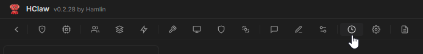
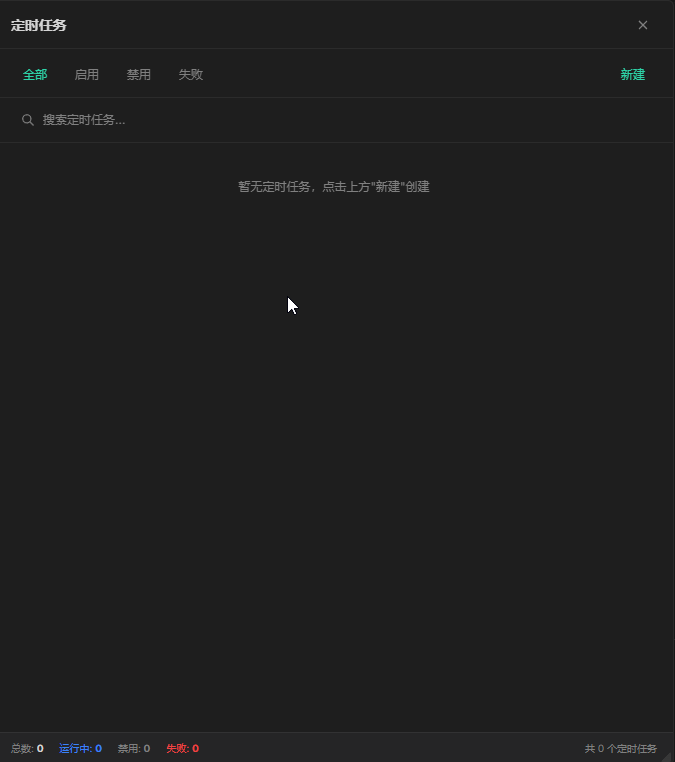
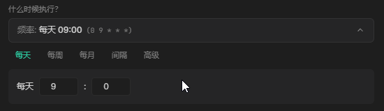

# 定时任务

## 概述

定时任务（Scheduled Tasks）基于 Cron 表达式自动调度，让 Agent 在指定时间自动执行任务。你可以设置每天定时发送日报、每 15 分钟检查服务器状态、工作日午夜执行数据备份等——一切自动进行，无需人工干预。

配合 IM 渠道（个人微信、飞书）使用效果更佳：任务完成后，Agent 可自动将结果发送到你的微信。

> 您也可以让HClaw帮您创建和修改定时任务

## 演示视频

> 🎥 演示视频制作中，敬请期待

## 开始配置

#### 进入定时任务管理

1. 点击菜单中的 **定时任务**

2. 进入任务列表页面

#### 便捷执行周期设置

#### 执行周期与触发精度

「执行周期」支持四种说法——**每天 / 每周 / 每月 / 间隔**（间隔可选「每 N 分钟」或「每 N 小时」），选完即可，不必自己写表达式。这四种说法覆盖不了的需求，切到「高级」直接写表达式。

定时任务的表达式是标准的 **5 段格式：分 时 日 月 周**，触发粒度最细到 1 分钟——引擎侧按分钟去重（同一分钟内的重复命中被跳过）。引擎每秒轮询一次，实际触发时刻落在命中的那一分钟内，通常 1 秒内；**编辑、暂停/恢复任务都不会清掉这个去重键**，同一分钟内改完名字仍只触发一次。唯一例外是**引擎重建**：重建会新建一个引擎实例，去重记录随内存一起清零，若重建恰好发生在已经触发过的同一分钟内，这一分钟可能再触发一次。新建任务或引擎重建时若当前分钟命中表达式，则会立即触发，最坏可接近 1 分钟。时区取系统时区。

表达式多写一段不会报错，但整条会被按 **秒 分 时 日 月 周** 解析，含义随之平移（例如 `0 9 * * * *` 会被当作「每小时第 9 分」，而不是每天 09:00）；再往上多写一段则直接报错。

#### 创建定时任务

1. 点击「新建」按钮
2. 填写任务名称（便于识别）
3. 设置 项目
4. 选择要使用的能力(Agent\Skill\命令)，或者某个本地脚本
5. 填写执行提示词（告诉 Agent 要做什么）
6. 设置执行周期
7. 保存并启用
8. 快速测试，可以立即执行一次

> 执行过程，会自动创建一个新的会话，便于您查看指令和任务执行过程

## 暂停与恢复

**启用中**的任务，列表行上都有一个 **暂停 / 恢复** 按钮（处于禁用态的行不显示它——那一行已经写着「已禁用」，重新启用后入口自然出现）。暂停和「启用 / 禁用」不是一回事，两者回答的是不同的问题：

- **启用 / 禁用**回答「这个任务该不该存在」——禁用是把它关掉。
- **暂停 / 恢复**回答「先别跑，但配置都留着」——暂停只让引擎停止触发，任务本身、表达式、提示词、执行记录全部原样保留，点「恢复」即按原表达式继续。

暂停状态**会一直保留**：应用重启、后台引擎重建后，它依然是暂停的，直到你手动恢复。行上的配置态会显示为「已暂停」，用以区分「已禁用」。

> 已暂停的任务仍可用「立即执行」跑一次，也可以直接编辑。

## 脚本任务的执行记录

Agent / Skill / Command 类型的任务，每跑一次会生成一个**调度会话**（在会话列表里以定时任务图标标识），执行过程就在会话里看。

**脚本（Script）类型不产生会话**，它的执行记录是**脚本日志**，直接落在磁盘上：

- 目录：`{配置根目录}/logs/schedules/`（配置根目录默认是 `~/.hclaw`，即 `C:\Users\<你的用户名>\.hclaw`）
- 文件名：`{任务ID}-{开始执行的时间戳}.log`

几点需要知道：

- **每次执行新建一个文件**，不覆盖历史记录，也不追加到同一个文件里。同一任务的历次执行就是目录下的若干文件，按开始时间排序。
- **没有数量上限，也不会自动清理**——日志会一直累积，需要时请自行删除旧文件。
- 单个文件是一整次执行的记录：执行时间、命令、参数、终端、成功/失败、耗时，以及输出（**标准输出与标准错误，受 10MB 缓冲上限约束**——超出上限或执行被中断时，可能只保留部分输出）。
- 在界面里查看日志时，**超过 20 万字符只显示前 20 万字符**，并在下方明确提示「内容过大，仅显示前…」。**落盘的文件仍然是全文**，界面上的截断只影响这一屏的显示，打开文件即可看到全部内容。

## 结合 IM 渠道

如果你已连接个人微信或飞书，在任务提示词中加入：

> "完成后，将结果发送到我的微信"

Agent 会自动将执行结果通过已连接的 IM 渠道推送到你的手机上。

## 后台引擎

定时任务由 HClaw **应用内置的后台引擎**负责触发——它跑在应用自己的后台线程里，没有被注册进操作系统的调度器，因此：

- **关闭应用后任务不会执行。** 应用不在运行，就没有进程在盯着时间。想让任务按时跑，请保持 HClaw 在后台运行。
- **引擎异常退出会自动重建。** 后台引擎意外崩溃时，应用会在约 5 秒后自动把它重新建起来，并重新装载全部已启用的任务（**含处于暂停状态的任务**，暂停标记不会丢）。
- **被中断的执行会被标记为失败。** 上次因为强退或崩溃而没跑完的任务，下次启动时会从「运行中」复位为「失败」，不会永远停在运行中——同时，那些残留的调度会话也会从运行中状态恢复为活跃，侧边栏不再一直闪动。

## 注意

- 定时任务依赖 HClaw 后台运行，关闭应用后任务不会执行
- 确保任务中使用的 Agent/Skill 已正确配置
- 保存时只检查「高级表达式不为空」，不做表达式语法校验：写错的表达式会让这个任务永不触发，痕迹只会写进应用控制台输出（本仓日志为 Console-only，打包版没有可查的持久化日志文件），界面上不会有提示
- 复杂任务建议先手动测试，确认无误后再启用定时调度

## 常见问题

**Q: 定时任务支持时区吗？**
- 使用系统时区

**Q: 「暂停」和「禁用」有什么区别？**
- 暂停：不触发，但任务的一切配置与历史都留着，点「恢复」即按原表达式继续
- 禁用：把任务关掉；两者的列表标记分别是「已暂停」和「已禁用」

**Q: 为什么任务没有在整点那一刻触发？**
- 触发粒度是分钟级。引擎每秒检查一次，命中的那一分钟内即触发，通常 1 秒内；引擎重建或新建任务时最坏可接近 1 分钟

**Q: 任务执行失败了怎么办？**
- 查看会话列表中的调度会话，查看指令和运行过程；脚本任务则看它的脚本日志
- 检查目标 Agent/Skill 是否可用
- 确认网络连接正常

**Q: 脚本的日志在哪里？**
- 在任务列表里展开该行即可就地查看；原始文件在 `{配置根目录}/logs/schedules/` 下，按每次执行一个文件存放
