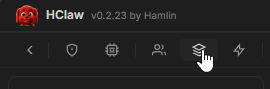
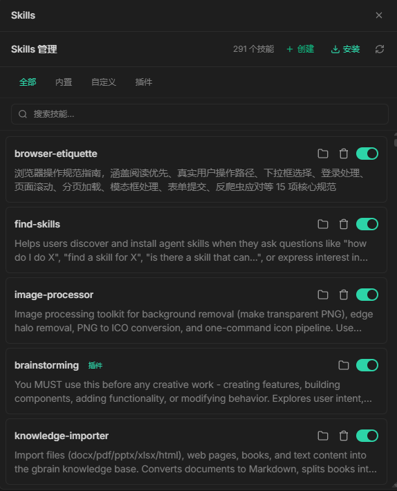
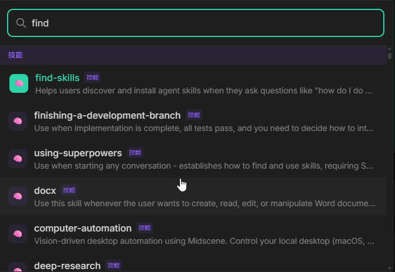

# Skills 管理

## 概述

Skills（技能）是 HClaw 中的"领域知识包"——每个 Skill 封装了特定领域的专业知识、工作流程和质量标准。当 Agent 遇到对应任务时，会自动匹配并加载最相关的 Skill，让 AI 的回答更专业、更精准。

例如，当你提到"帮我抠图"时，Agent 会自动匹配 `image-processor` 技能，调用专业的图像处理工具完成背景移除。

## 演示视频

> 🎥 演示视频制作中，敬请期待

## 开始配置

#### 进入 Skills 管理

1. 点击菜单中的 **Skills** 按钮

2. 进入技能管理页面

#### 查看已安装的技能

技能列表分为两类：

| 类型 | 说明 |
|-----|------|
| 🏠 内置技能 | 系统预装，开箱即用 |
| 📦 自定义技能 | 用户安装或自行开发 |

#### 安装Skills

1. 从skills.sh、github、gitee 上找到您想安装的skill，让HClaw帮您安装
2. 安装find-skills，让HClaw使用这个技能，帮您查找并安装您想要的skill
3. 点击「安装」按钮，选择您手动下载的skill仓库zip包

## 使用Skill

> 1. 按 `Ctrl + K` 也可搜索和调用已安装的skills
> 
> 2. 对话中，主动要求使用某个技能
> 
> 3. HClaw运行中也会自主决策使用某个skill

#### 创建自定义技能

高级用户可根据 Skill 开发规范自行编写技能：

1. 点击「创建」按钮
2. 填写技能元信息（名称、描述、提示词）
3. 编写技能的工作流程和知识内容(暂不支持)
4. 保存并启用

> 当前只支持SKILL.md文件通过图形界面创建，目前版本，建议通过HClaw帮您创建，HClaw会按您的要求，补充脚本、知识等内容。您也可以询问HClaw技能所在目录位置，手动编辑维护。

## 注意

- 技能安装后，检查skills列表，或者通过Ctrl+K尝试是否可以搜索到，如果搜索不到，可以点一下Skills管理页面的刷新按钮
- 无需开启新会话，下一次用户提问，即可使用新增技能

## 常见问题

**Q: 技能和 Agent 有什么区别？**
- Agent 是"角色"，决定 AI 的行为模式和能力范围
- Skill 是"知识包"，提供特定领域的专业知识和工作流程
- 一个 Agent 可以调用多个 Skill

**Q: 技能安装失败怎么办？**
- 检查网络连接
- 尝试从市场重新安装
- 让HClaw自己修复，比如发送指令：帮我修复 D:/**/**/SKILL.md

**Q: 如何分享我创建的自定义技能？**
- 找到SKILL所在目录(可以问HClaw)，提交到技能市场仓库等待审核
