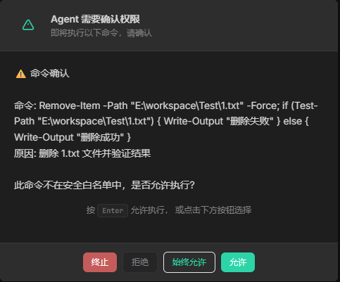

# 工具管理

## 概述

工具（Tools）是 Agent 与外界交互的桥梁。

Agent 通过工具执行文件操作、运行命令、搜索网络、查询数据库等任务。

每个工具就像 Agent 的"手"和"眼睛"，让 AI 从单纯的语言模型变为能行动的智能助手。

HClaw 内置了丰富的工具集，覆盖文件操作、代码执行、网络请求、用户交互等常见场景。

## 演示视频

> 🎥 演示视频制作中，敬请期待

## 开始配置

#### 进入工具管理

1. 点击菜单中的 **工具**

2. 即可查看当前可用的工具列表，您可以随时启用或禁用它们

#### 内置工具一览

| 工具         | 说明 | 
|------------|------|
| `file_read` | 读取文件内容 |
| `file_write` | 写入文件内容 | 
| `file_edit` | 编辑文件指定片段 | 
| `bash`     | 执行 Shell 命令 |
| `grep`     | 搜索文件内容 |
| `glob`     | 按模式查找文件 |
| `web_fetch` | 获取网页内容 |
| `ask_user` | 向用户提问 |
| ...        |||

当 Agent 需要使用高权限工具时，会弹出确认窗口：

操作选项：
- **允许本次** — 仅当前操作放行
- **永久放行** — 后续同类操作不再询问
- **拒绝** — 禁止该操作
- **终止** — Agent 停止工作

> 已永久放行的操作可在`权限规则`窗口中查看和删除

#### 工具启用/禁用

每个工具可独立启用或禁用：

1. 在工具列表中找到目标工具
2. 点击开关按钮切换状态
3. 禁用的工具 Agent 将无法调用

## 注意

- bash 工具执行命令时，高危操作有默认拦截，普通拦截，请仔细阅读是否放行
- 自由模式下虽然不弹窗确认，但危险命令仍会被自动拦截

## 常见问题

**Q: 如何撤销"永久放行"的操作？**
- Ctrl+Shift+B → 已放行操作列表
- 找到需要撤销的条目，点击删除即可

**Q: 可以添加自定义工具吗？**
- 暂时不可以，自定义工具建议通过MCP服务扩展
