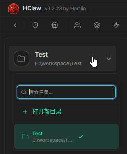
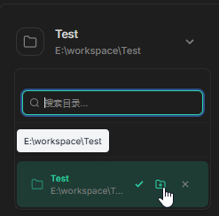
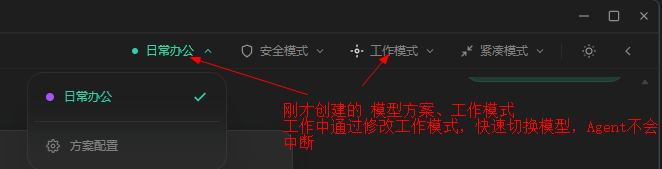
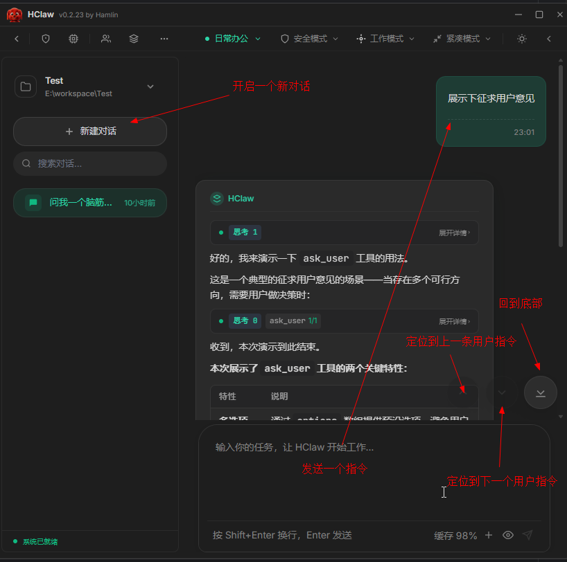

# HClaw `工作目录`配置

## 概述

`工作目录`用于定义 HClaw 当前的工作目录，HClaw可`查阅` `编辑` 当前工作目录中的文件。

## 演示视频

## 开始配置

#### 添加工作目录

1. 点击`工作目录`下拉框

2. 点击图中`打开新目录`按钮，选择一个本地目录即可
3. 两个快捷按钮 `在资源管理器中打开此目录` `删除`

4. 最后确认一下`模型方案` `工作模式` 两个下拉框

5. 点击 `新建会话` 开始对话吧

## 注意
`运行模式` 下拉框
自由模式，不会弹出权限确认，但默认拦截危险指令，新手用户不建议使用
安全模式，默认拦截危险指令的情况下，部分操作，需要用户确认，永久放行后，不会再弹出确认窗口，也可以随时删除已永久放行的命令。

`消息显示` 下拉框
请自行探索

## 常见问题

**Q: API 调用失败怎么办？**
- 检查使用的API类型
    - OpenAi 类型，base url通常以/v1结尾
    - Anthropic 类型，base url通常以/anthropic结尾
- 检查 API Key 是否正确
- 确认您的网络可以访问对应服务商的 API 地址

**Q: 一直显示思考中**
- 检查输入框下方提示信息
- 检查网络是否通畅
- 检查服务商服务器是否繁忙
- 建议使用 DeepSeek 官方直连按量付费进行测试(价格便宜，稳定性最好)，是否是HClaw问题还是网络、服务商问题
